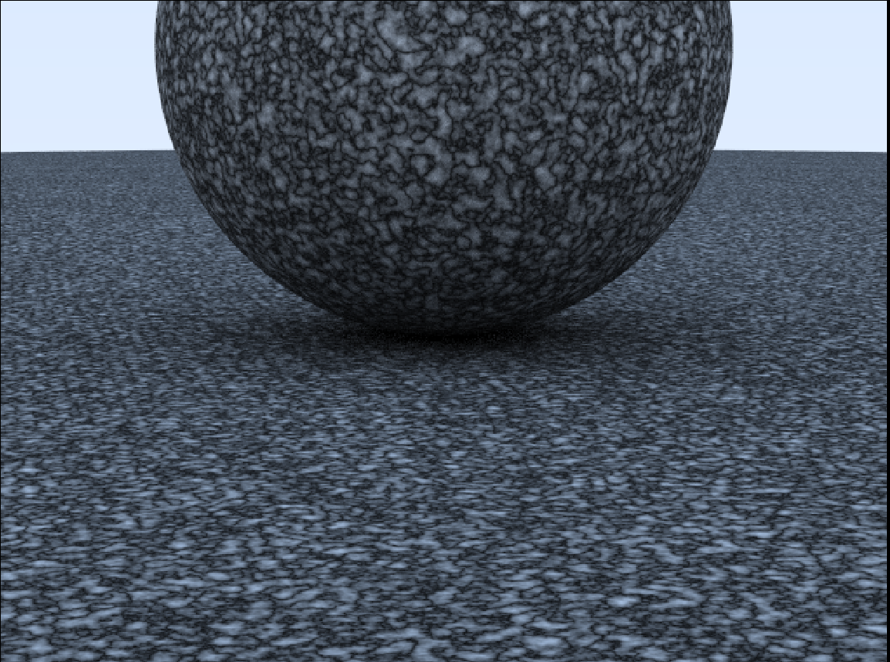

#RayTracer

Following the Ray Tracing in One Weekend books by the great Peter Shirley.  https://raytracing.github.io/ .  

Most of the code is in C++.  Some that was ported to CUDA and OPENCL shows significant speedup as expected.  CUDA was tested recently.  OPENCL was not tested since many years ago when the code was implemented.

   
   
   
   
   
   
   
   
   
   
   
   
   
   
